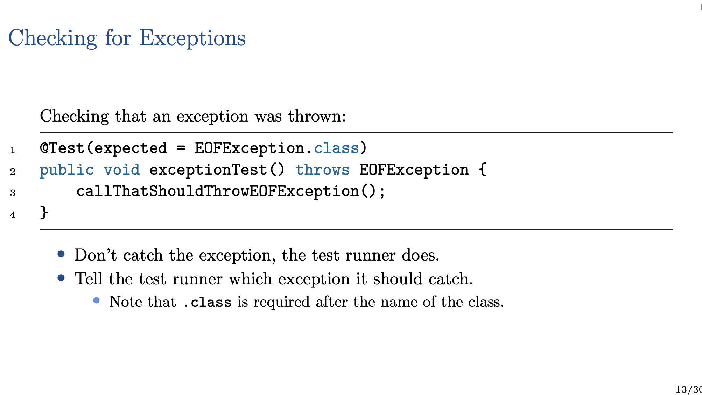

### Collections & Testing
#### CSSE2002 | Lecture 4

----

> **Arrays are not great for everything**, so what are the other options?

### Buit-in Collections
- Stack 
- List
- Set
- Map

---

## Stack Operations (LIFO)
import java.util.Stack;

empty() - Tests if the stack is empty or not.
peek() - Return the oject at the top of the stack without removing it.
pop() - Removes the object at the top of the stack and returns that object.
push(obj) - Pushes an object onto the top of the stack.

To declare a stack of Cats:
>      Stack<Cat> s = new Stack<Cat>();

OR the compiler can infer <String> from the declared type of s:

>      Stack<String> s = new Stack<>();

### What is a Stack good for?
- Reversing things?
- Putting something aside to come back to later while you deal with something
else now.
- Depth-first search in a tree or graph.

#### Exercise
Implement a method, Stack<String> reverse(Stack<String>), that creates a
new flipped stack.

>    '''
>        public class Stacks {
>       static StackString> reverse(Stack<String> words) {
>       Stack<String> reversed = new Stack<>();
>      while (!words.isEmpty()) {
>       String word = words.pop();
>       result.push(word);
> }
> return result
> }
> }

### Primitives

> What about

>       Stack<int>
> - Collections only store objects

Java has a class for each primitive type:
Boolean, Byte, Character, Double, Float, Integer, Long, Short

So you can have Stack<Integer>

*Autoboxing* -- creates objects from primitives in the background.
- Primitives are not objects

#### Exercise
Implement a method, int sum(Stack<Integer>), that returns the sum of all
integers in the given stack.

>    
>      static int sum(Stack<Integer> numbers) {
>     int sum = 0;
>      while (!numbers.isEmpty()) {
>      sum += numbers.pop();
>     }
>     return sum;
>     }

---
### List
##### Overview

Lists hold items in sequential order, much like an array
- Grow and shrink automatically
- No fixed size
- Insert an item anywhere in the list.
- Remove an item anywhere in the list.
- Check if an item is in the list.
- Index from zero, start of list.

##### Interface
A **List** is an interface, not  aparticular implementation.
- Can declare a list of any type: List \<String>
- Can not create a list instance: new List\<String> 

##### Implementation

Popular List Implementations:
- ArrayList better for random access.
ArrayList\<String>
- LinkedList better for operations that modify the middle of the list.
LinkedList\<String>

##### Example

---

### Set
##### Overview

Sets store unique items
- No duplicates
- No order
- Iterate over the set
- Add item to set.
- Remove item from set
- Check if an item is in set

##### Implementations

Popiular Set Implementations:
- HashSet\<E> -- E must have snesible hashCode() and equals() methods
- TreeSet\<E> --- E must implement Comparable, e.g. String

> Returns true if an item does not exit essentially
---

### Map
- Maps store key → value pairs (similar to a Python dictionary).

- Map<Integer, String>
  - Integer keys mapping to String values.
  
##### Implementations
Popular Map implementations:
- TreeMap<K, V> — K must implement Comparable.
- HashMap<K, V> — K must have sensible hashCode() and equals() methods.

##### Demonstration

---
### Map and Set
##### Custom Classes
It is not enough that interface methods exist, they must obey their contract.

See the documentation for Comparable and Map.

### Exercise
Implement a board to represent a Tic Tac Toe game using a Map.

TicTaoToe.java
>       public class TicTacToe {
>           public static void main(String[] args) {
>              Map<Position, Character> board = new HashMap<>();
> 
> 
>               for(int x = 0; x < 3; x++) {
>                 for(int y = 0; y < 3; y++) {
>                   board.put(new Position(x, y), ' ');
>                }
>            }
>
>           for(Position p : board.keySet()) {
>             System.out.println(p + " " + board.get(p));
>         }
>          System.out.println(board);
>     }
>     

Position.java
>       public class Position {
>          private int x;
>          private int y;
>       }
>
>      public int getX() {
>        return x;
>     }
>
>     public int getY() {
>       return y;
>        }
>
>       @override
>       public boolean equals(Object o) {
>       if (obj instanceof Position position) {
>        return x == position.x && y == position.y;
>        }
>       return false;
> 
>         }
>        @Override
>           public int hashcode() {
>           return Integer.hashCode(x) + Integer.hashCode(y);
>       }
>          public Position(int x, int y) {
>             this.x = x;
>            this.y = y;
>         }
>       }
>

**WARNING**
- Do not use mutable objects as keys
- If you use mutable objects as keys (this should be avoided), do not change
them once they are in a Set or Map

---
### Testing 

##### Types of Testing
> **Unit Testing** 
Check that each “unit” (class) in the project behaves correctly.
**Integration Testing**
Check that components work together and that the interfaces between
components work as expected.
**System Testing**
Does the sytem as a whole work correctly?
**(User) Acceptance Testing**
Do users of the system agree that the system does what it is supposed to do?

##### Test Frameworks
For Java, this is JUnit

##### Regression Testing 
During development, testing can help answer (at least) two questions:
1. Does the new stuff work?
1. Have we broken things which used
to work?
    - Have we regressed?

----
### Testing
##### Black Box vs Glass Box

> **Black Box Testing**
> - The software has inputs and outputs to test, but the implementation is unknown to you.
> - You test according to the specification.

----
### JUnit

---
### Assert

Some static methods in Assert:
- assertEquals(expected, actual)
- assertArrayEquals(expected, actual)
- assertTrue(condition) and assertFalse(condition)
- assertSame(expected, actual) and assertNotSame(expected, actual)
- fail

> **To avoid writing Assert. on everything, we can do this:**
> 
>          import static org.junit.Assert.*;
> Allowing us to just use the method names

##### Checking for Exceptions

### Running Tests

---
### Smoke Tests

### Boundary Testing

##### Execise

Write black box tests for contains

>        /**
>        * Determine if value is contained within the array.
>        *
>        * @requires array is sorted in ascending order.
>        * @return true if value is in the array, false otherwise.
>
>        */
>
>        boolean contains(int[] array, int value)

>        public class ContainsTest {
>        @ Test
>        public void testContains() {
>        Assert.assertTrue(Contains.contains(new int[]{1, 2, 3, 4, 5}, 3));
>       }
>       
>       @Test 
>       public void testContainsEmpty() {
>       Assert.assertFalse(Containscontains(new.int[]{}, 2));
>       }
> }